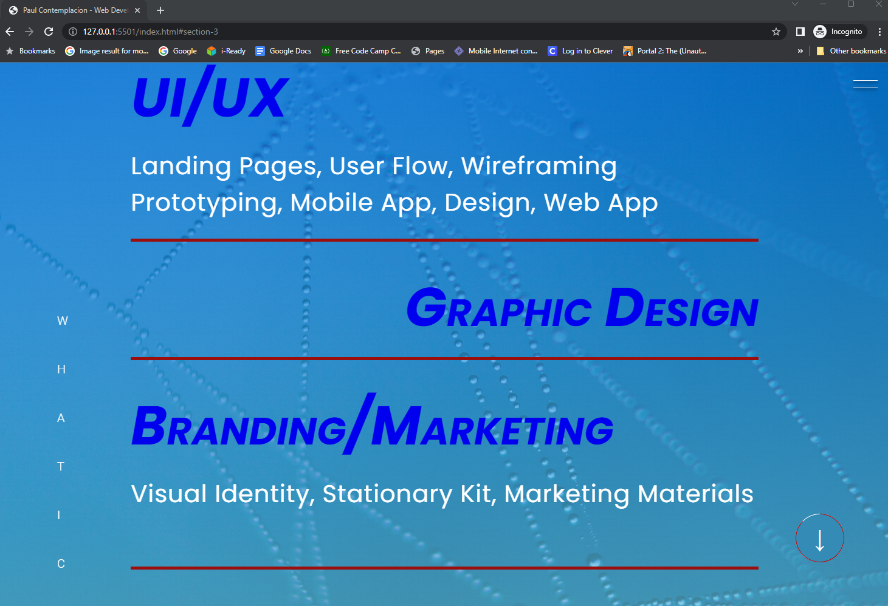
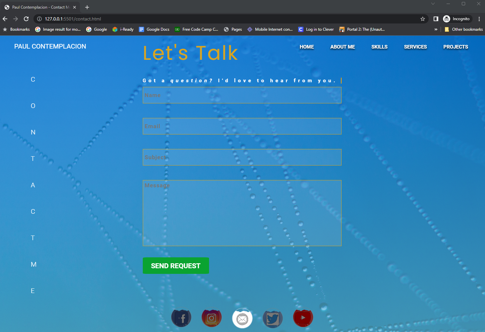

# *Paul Contemplacion* [Portfolio](https://github.com/paulbcon/portfolio)
This project is a requirement for *HTML/CSS/Javascript* Skill-Based Assessment (SBA) of __*Per Scholas 18-week Java Full Stack Developer course*__. It is a sample personal portfolio to show skills in creating a *responsive, interactive* web site.

## Deliverable:

* A theme for your site that you feel comfortable with
* Complete all technical requirements for HTML, CSS, and Javascript
* Research for a public API that can provide you with content (Optional)
* Include a README file. The file should include technical specifications and a description of your website.
* Host on GitHub,  include the link to your GitHub account in the README file(optional)
* Submit the project in a ZIP file

## Technical Requirements:

### HTML

* Have at least 3 pages, keep the grid system consistent as much as possible
* Use at least 10 different HTML tags
* Use HTML tables
* Implement at least two uses for forms
* Dropped Down Menu 
* Use web fonts
* Use different types of content in the form of text, images, videos, and GIFs
* Use regex validation

### CSS

* Inline, internal, and external styling
* Use five different CSS selectors
* Don’t use too many fonts
* Use colors that complement each other
* Use Flexbox (Optional)
* Use SASS/SCSS (Optional)
* Use animations (Optional)

### Javascript

* External scripts
* Use variables, if statements, loops, at least one form of collections, functions/call back, and events.
* Use AJAX (Optional) 
* Use JSON or XML (Optional)
* Use JQuery (Optional)

*Project images used were for presentation purposes only and not actual projects*

## Sample Pages

